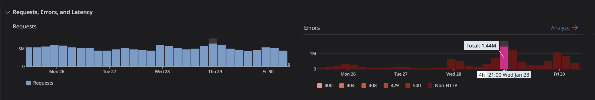
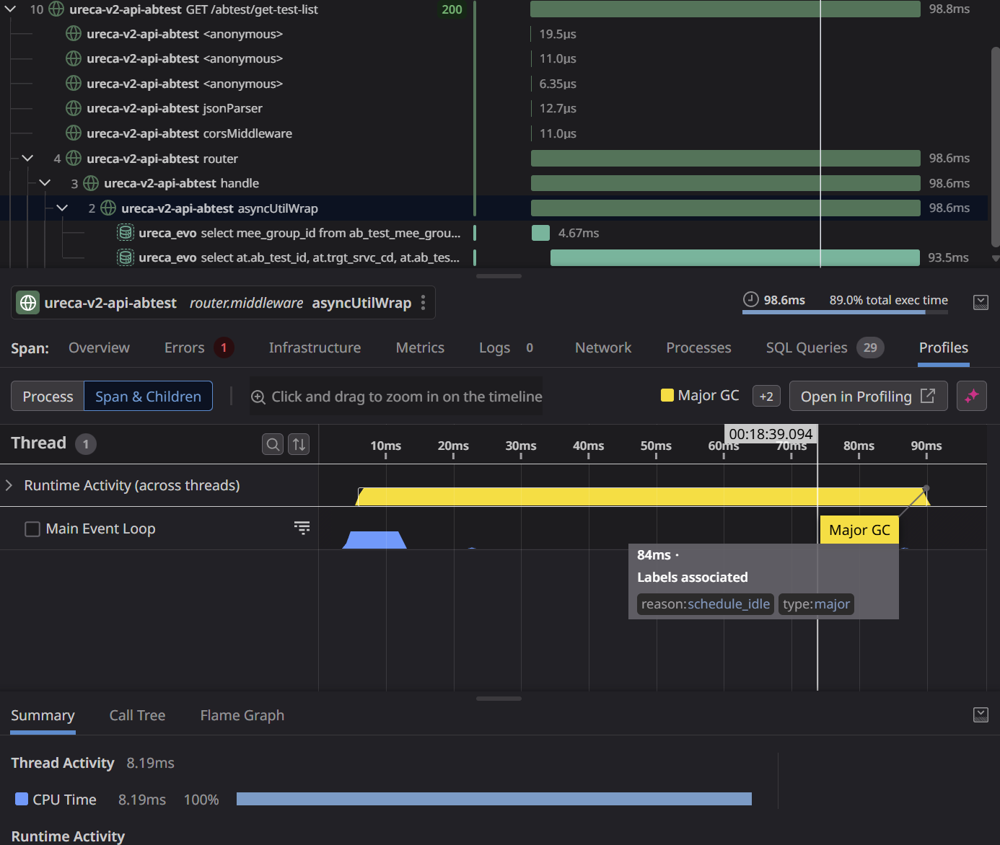
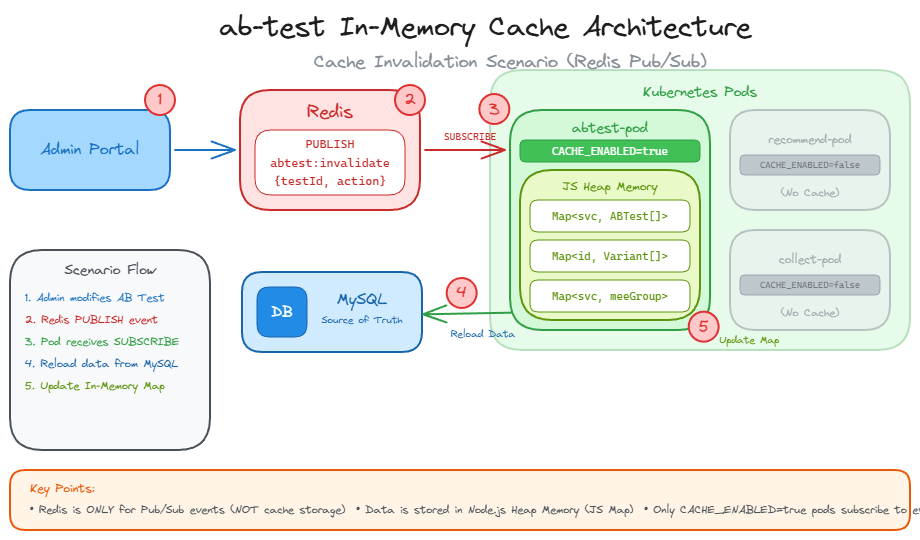

# In-Memory AB Test Cache 아키텍처 설계

## 0. 실제 문제 현황 (프로파일링 결과)

### 서비스 제약사항
- **SLA**: 30ms 이내 응답 필수 (초과 시 클라이언트 타임아웃 → 에러)
- **트래픽**: 일일 2M~4M 요청
- **에러 현황**: 피크 시 500k~1M 에러 발생



### APM 프로파일링 결과



### 병목 분석

| 구간 | 소요 시간 | 문제점 |
|------|----------|--------|
| SQL 쿼리 1 (mee_group) | 4.67ms | - |
| SQL 쿼리 2 (ab_test) | 93.5ms | SLA 3배 초과 |
| **Major GC** | **84ms** | **요청 중 STW 발생** |
| 실제 CPU 처리 | 8.19ms | - |

### 원인 추론

```
트래픽 증가 → 요청당 ~10개 객체 생성 → Heap 빠르게 채워짐
    → Old Generation 승격 증가 → Major GC 트리거
    → 84ms Stop-The-World → 30ms SLA 실패
```

---

## 1. 대응 방안: 1차 Pod 증가 vs 2차 In-Memory 캐시

### 1차 대응 (단기): Pod 수 증가

### 2차 대응 (중기): In-Memory 캐시 도입

| 장점 | 단점 |
|------|------|
| GC 빈도 감소 | 구현 복잡도 높음 |
| 트래픽 증가에도 안정적 | 개발 리소스 필요 |
| DB 부하 제거 | 캐시 일관성 관리 필요 |


---

### 2차 대응 전 GC 원인 상세 확인

```bash
# GC 로그 활성화하여 실행
node --trace-gc app.js

# 출력 확인
[12345:0x...] 84 ms: Mark-sweep 150.5 (200.0) -> 100.2 (180.0) MB, 
  84.3 / 0.0 ms (average mu = 0.850, current mu = 0.750) 
  allocation failure  # ← 객체 생성 과다 확정 → 캐시 도입 필요
  # 또는
  idle                # ← 우연히 겹친 것 → Pod 증가로 충분할 수 있음
```

| GC 원인 | 의미 | 권장 대응 |
|---------|------|----------|
| `allocation failure` | 객체 생성 과다 | 2차 캐시 도입 필수 |
| `idle` | 유휴 시간 스케줄링 | 1차 Pod 증가로 충분 |

---

### 참고 자료

[캐시 전후 비교](./GC-BENCHMARK-REPORT.md)

---

## 2. 현재 구조 (As-Is)

```
┌─────────────────────────────────────────────────────────────────────────────┐
│                            매 요청마다 반복                                   │
└─────────────────────────────────────────────────────────────────────────────┘

  Client Request
        │
        ▼
┌───────────────┐     ┌───────────────┐     ┌───────────────┐
│   Controller  │────▶│ GatewayService│────▶│   Repository  │
└───────────────┘     └───────────────┘     └───────┬───────┘
                              │                     │
                              │                     ▼
                              │              ┌─────────────┐
                              │              │   MySQL DB  │
                              │              └─────────────┘
                              │                     │
                              ▼                     │
                      ┌───────────────┐             │
                      │ FormatConverter│◀───────────┘
                      │ (async 함수)   │
                      └───────┬───────┘
                              │
                              │  매번 새 객체 생성:
                              │  - JSON.parse(attributeFilter)
                              │  - toISOString() 호출
                              │  - 9개 필드 복사
                              ▼
                      ┌───────────────┐
                      │  Response 생성 │
                      └───────────────┘

GC 압력:
  - 요청당 DB 쿼리: 2회 (MEE그룹 + AB테스트)
  - 요청당 객체 생성: ~10개
  - JSON 파싱: N회/요청
```

---

## 3. 제안 구조 (To-Be)



```
┌─────────────────────────────────────────────────────────────────────────────┐
│                         서버 시작 시 1회만 로드                               │
└─────────────────────────────────────────────────────────────────────────────┘

                                              ┌─────────────┐
                                              │   MySQL DB  │
                                              └──────┬──────┘
                                                     │
                                                     │ 서버 시작 시
                                                     │ 전체 로드
                                                     ▼
┌─────────────────────────────────────────────────────────────────────────────┐
│                        In-Memory Cache (lru-cache)                          │
│  ┌─────────────────────────────────────────────────────────────────────┐    │
│  │                    serviceCache (단일 통합 캐시)                     │    │
│  │  Map<service, { meeGroupId, tests: [{ ...test, variants: [...] }] }>│    │
│  └─────────────────────────────────────────────────────────────────────┘    │
│                                                                              │
│  객체는 메모리에 한 번만 생성되어 재사용됨 (GC 압력 없음)                       │
└─────────────────────────────────────────────────────────────────────────────┘
        ▲                       │
        │ Redis Pub/Sub         │ 직접 참조 반환
        │ (데이터 변경 시)        │ (새 객체 생성 없음)
        │                       ▼
┌───────────────┐       ┌───────────────┐
│  Redis Server │       │ GatewayService│
└───────────────┘       └───────┬───────┘
        ▲                       │
        │                       ▼
┌───────────────┐       ┌───────────────┐
│ Admin Portal  │       │   Response    │
│ (캐시 무효화)  │       │ (캐시 객체    │
└───────────────┘       │  그대로 사용)  │
                        └───────────────┘

GC 압력:
  - 요청당 DB 쿼리: 0회
  - 요청당 객체 생성: 0~1개 (응답 래핑만)
  - JSON 파싱: 0회/요청
```

---

## 4. 캐싱 전략 비교

```
┌─────────────────────────────────────────────────────────────────────────────┐
│                         캐싱 레벨 비교                                       │
├─────────────────────────────────────────────────────────────────────────────┤
│                                                                              │
│  Level 0 (현재)        Level 1                   Level 2 (권장)             │
│  ─────────────        ─────────                 ─────────                   │
│  캐싱 없음            DB ResultSet 캐싱          변환 객체 캐싱              │
│                                                                              │
│  DB 쿼리: 매번        DB 쿼리: 0               DB 쿼리: 0                   │
│  변환: 매번          변환: 매번                변환: 0                      │
│  GC 개선: 0%         GC 개선: ~30%             GC 개선: ~70%                │
│                                                                              │
│  권장: Level 2 (변환 객체 캐싱)                                              │
│                                                                              │
└─────────────────────────────────────────────────────────────────────────────┘
```

---

## 5. 구현 방식: lru-cache + Redis Pub/Sub

### 4.1 왜 lru-cache인가?

| 방식 | 장점 | 단점 |
|------|------|------|
| 직접 Map 구현 | 간단 | 로드 로직이 여러 곳에 분산 |
| **lru-cache** | fetchMethod로 로드 로직 한 곳에 집중 | 의존성 추가 |

**lru-cache의 fetchMethod**: 캐시 미스 시 자동으로 호출되어 DB 로드 + 변환 수행

### 4.2 동작 흐름

```
서버 시작
    │
    ▼
┌─────────────────────────┐
│ 1. 프리로드              │  cache.fetch(service) 호출
└───────────┬─────────────┘
            │
            ▼
┌─────────────────────────┐
│ 2. Redis 구독            │  'abtest:invalidate' 채널
└───────────┬─────────────┘
            │
            ▼
      정상 서빙 중 ◀──────────────────────┐
            │                              │
    [Redis 이벤트 수신]                    │
            │                              │
            ▼                              │
┌─────────────────────────┐                │
│ 3. 캐시 삭제 (eviction)  │  cache.delete(service)
└───────────┬─────────────┘                │
            │                              │
    [다음 요청]                            │
            │                              │
            ▼                              │
┌─────────────────────────┐                │
│ 4. 캐시 미스 → 자동 로드 │  fetchMethod 자동 호출
└───────────┬─────────────┘                │
            │                              │
            └──────────────────────────────┘
```

**핵심 포인트:**
- Redis 이벤트 → `cache.delete()` 만 호출 (eviction)
- 다음 요청 → `fetchMethod`가 자동으로 DB 로드
- 로드 로직이 **fetchMethod 한 곳에만** 존재

### 4.3 구현 코드

**설치:**
```bash
npm install lru-cache
```

**ABTestCache.js:**
```javascript
const { LRUCache } = require('lru-cache');
const { createClient } = require('@redis/client');

class ABTestCache {
  constructor() {
    this.cache = new LRUCache({
      max: 100,
      // 캐시 미스 시 자동 호출
      fetchMethod: async (service) => {
        return await this.loadFromDB(service);
      }
    });
    this.subscriber = null;
  }

  // ========================================
  // DB 로드 + 변환 (Level 2)
  // 이 로직이 fetchMethod 한 곳에만 존재
  // ========================================
  async loadFromDB(service) {
    const testRows = await abTestRepository.getABTestsByService(service);
    const testIds = testRows.map(t => t.ab_test_id);
    const variantRows = await abTestRepository.getVariantsByTestIds(testIds);
    const meeGroup = await abTestRepository.getMeeGroupId(service);
    
    // 변환 + 조합
    const tests = testRows.map(test => ({
      id: test.ab_test_id,
      name: test.ab_test_nm,
      type: test.ab_test_type,
      status: test.ab_test_status,
      attributeFilter: JSON.parse(test.ab_test_atrb_fltr || '{}'),
      startDate: test.strt_dtm?.toISOString(),
      endDate: test.end_dtm?.toISOString(),
      variants: variantRows
        .filter(v => v.ab_test_id === test.ab_test_id)
        .map(v => ({
          id: v.vrnt_id,
          key: v.vrnt_key,
          ratio: v.vrnt_ratio,
          payload: JSON.parse(v.vrnt_payload || '{}')
        }))
    }));
    
    return {
      meeGroupId: meeGroup[0]?.mee_group_id,
      tests: tests
    };
  }

  // ========================================
  // 초기화 (서버 시작 시)
  // ========================================
  async initialize() {
    if (process.env.ABTEST_CACHE_ENABLED !== 'true') {
      console.log('ABTest Cache disabled');
      return;
    }
    
    // 프리로드
    const services = await abTestRepository.getAllServices();
    for (const service of services) {
      await this.cache.fetch(service);
    }
    console.log(`ABTest Cache loaded: ${services.length} services`);
    
    // Redis 구독
    await this.subscribeToInvalidation();
  }

  // ========================================
  // Redis 구독 (eviction만 수행)
  // ========================================
  async subscribeToInvalidation() {
    this.subscriber = createClient({ url: process.env.REDIS_URL });
    await this.subscriber.connect();
    
    await this.subscriber.subscribe('abtest:invalidate', (message) => {
      const { service, type } = JSON.parse(message);
      
      if (type === 'ALL') {
        this.cache.clear();
      } else {
        this.cache.delete(service);  // eviction만!
      }
      // DB 로드 안 함 → 다음 요청 시 fetchMethod가 자동 처리
    });
  }

  // ========================================
  // 조회 API
  // ========================================
  async getMeeGroupId(service) {
    const data = await this.cache.fetch(service);
    return data?.meeGroupId;
  }
  
  async getActiveTests(service) {
    const data = await this.cache.fetch(service);
    if (!data) return [];
    
    const now = new Date();
    return data.tests.filter(test => 
      test.status === 'ACTIVE' &&
      new Date(test.startDate) <= now &&
      new Date(test.endDate) >= now
    );
  }
}

module.exports = new ABTestCache();
```

**app.js에서 초기화:**
```javascript
const abTestCache = require('./services/ABTestCache');

app.listen(PORT, async () => {
  await abTestCache.initialize();
});
```

**서비스에서 사용:**
```javascript
const abTestCache = require('./ABTestCache');

const processABTest = async (request) => {
  const meeGroupId = await abTestCache.getMeeGroupId(request.service);
  const activeTests = await abTestCache.getActiveTests(request.service);
  // ...
};
```

**Admin에서 캐시 무효화:**
```javascript
const invalidateCache = async (service) => {
  const publisher = createClient({ url: process.env.REDIS_URL });
  await publisher.connect();
  await publisher.publish('abtest:invalidate', JSON.stringify({ service, type: 'SERVICE' }));
  await publisher.disconnect();
};
```

---

## 6. 캐시 데이터 구조

```javascript
// cache.fetch('GalaxyStore') 반환값
{
  meeGroupId: 'mee_group_123',
  tests: [
    {
      id: 1,
      name: '배너 테스트',
      type: 'SEGMENT',
      status: 'ACTIVE',
      attributeFilter: { country: ['KR', 'US'] },  // ← 객체 (JSON 파싱 완료)
      startDate: '2026-01-01T00:00:00.000Z',
      endDate: '2026-12-31T23:59:59.000Z',
      variants: [
        { id: 10, key: 'A', ratio: 50, payload: { color: 'red' } },
        { id: 11, key: 'B', ratio: 50, payload: { color: 'blue' } }
      ]
    }
  ]
}
```

---

## 7. GC 영향 비교

### Before (현재)

| 항목 | 요청당 | 1000 RPS | 시간당 |
|-----|--------|----------|--------|
| DB 쿼리 | 2회 | 2,000회 | 7.2M 쿼리 |
| 객체 생성 | ~10개 | 10,000개 | 36M 객체 |
| JSON 파싱 | 3회 | 3,000회 | 10.8M 파싱 |
| 메모리 할당 | ~5KB | 5MB/s | **18GB/시간** |

### After (lru-cache)

| 항목 | 요청당 | 1000 RPS | 시간당 |
|-----|--------|----------|--------|
| DB 쿼리 | **0회** | 0회 | 0 쿼리 |
| 객체 생성 | **1개** | 1,000개 | 3.6M 객체 |
| JSON 파싱 | **0회** | 0회 | 0 파싱 |
| 메모리 할당 | ~200B | 200KB/s | **720MB/시간** |

**GC 압력 감소: ~70%**

---

## 8. Redis Pub/Sub 메시지

### 채널
```
abtest:invalidate
```

### 메시지 형식
```json
// 특정 서비스 캐시 삭제
{ "service": "GalaxyStore", "type": "SERVICE" }

// 전체 캐시 삭제
{ "type": "ALL" }
```

---

## 9. Monorepo Pod 선택적 활성화

```yaml
# abtest-deployment.yaml
env:
- name: ABTEST_CACHE_ENABLED
  value: "true"

# recommend-deployment.yaml (캐시 불필요)
env:
- name: ABTEST_CACHE_ENABLED
  value: "false"
```

캐시 비활성화 시:
- Redis 연결 안 함
- 메모리 사용 0
- 기존 DB 직접 조회 방식 유지
